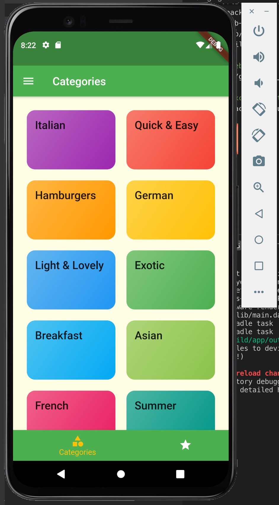
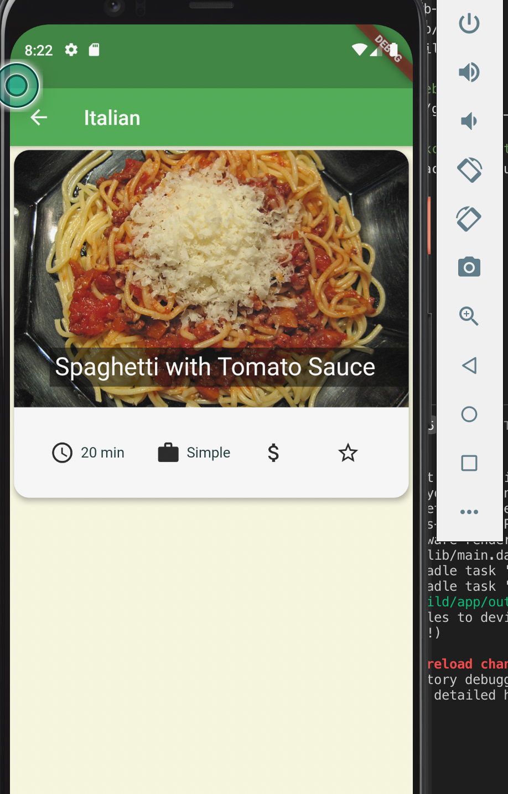
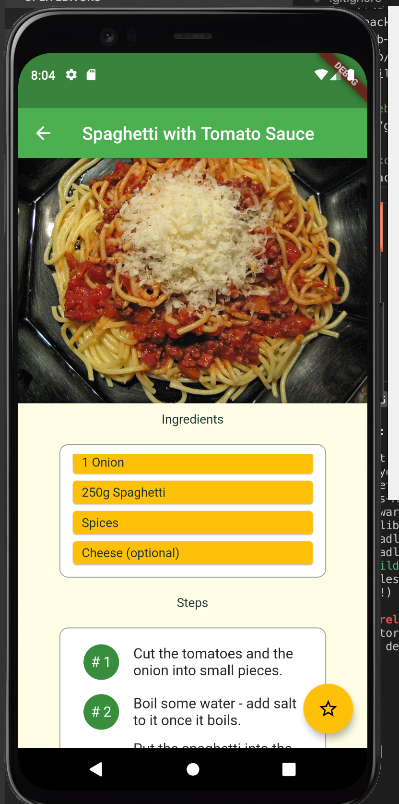
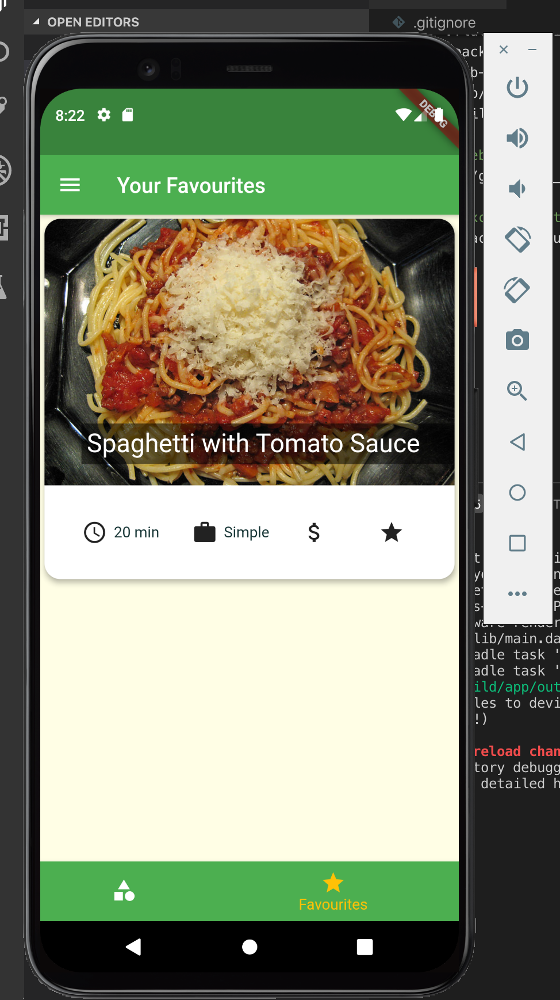
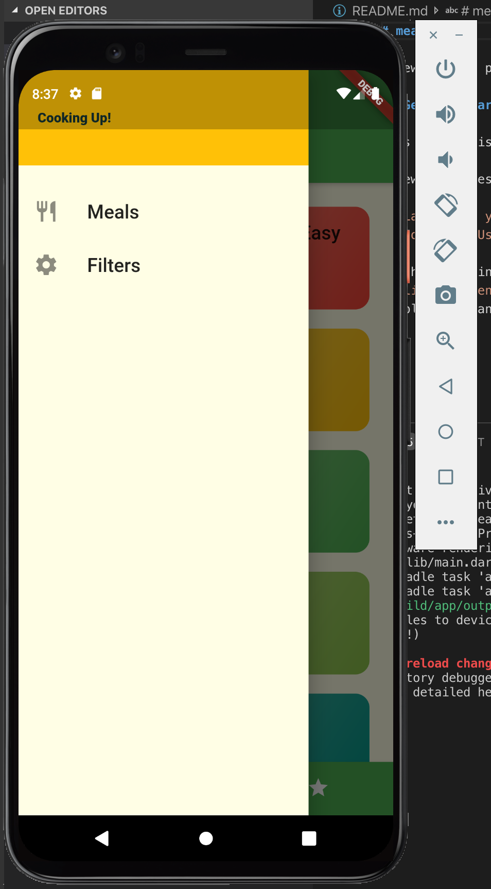
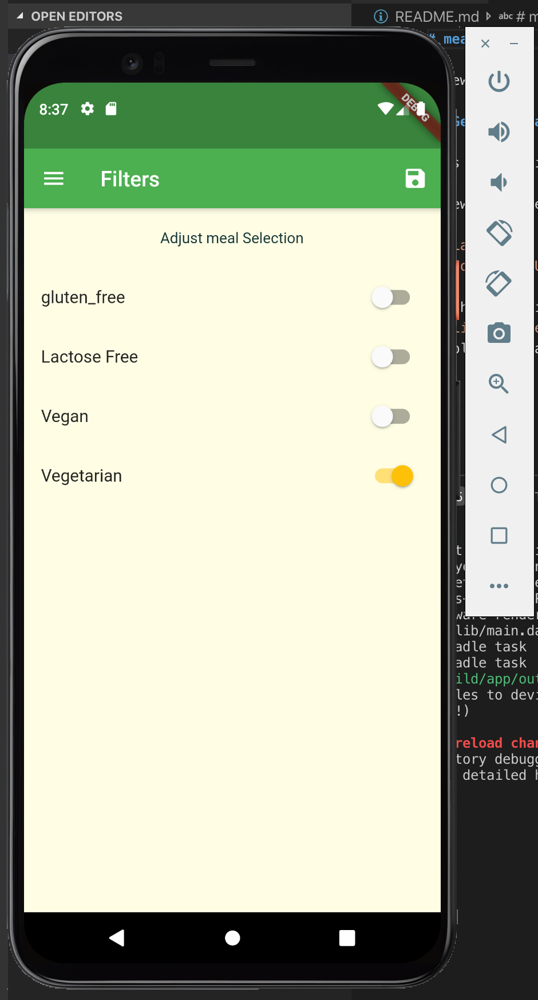

# Meals App

> Mobile App that lets user to view recipes for a variety of food items across various cuisines

## Table of contents

* [General info](#general-info)
* [Screenshots](#screenshots)
* [Technologies](#technologies)
* [Setup](#setup)
* [Features](#features)
* [Status](#status)

## General info

Users can view recipes for a variety of food items across various cuisines. The application also allows user to add the recipe to favourites or filter recipes based on meal selection.

## Screenshots

1.Home Screen

2.Category Screen

3.Recipe Screen

3.Favourite recipes screen

4.Sidebar

5.Filter Recipes screen

## Technologies

* Flutter
* Dart
* Visual Studio Code
* Android Virtual Device (AVD)

## Setup

*Clone Project from github
*Install Android Sdk Manger and run android virtual device 
*Run `flutter run` . App automatially loads in any connected device.

## Features

Features ready for users,

* User can view all meal categories
* User can view recipes
* User can add recipe to favourites
* User can filter recipes based on meal selection

To-do list,

* Ability to add new recipes
* Add login functionality.
* Integrate with backend (firestore) for database

## Status

Project is: _in progress_